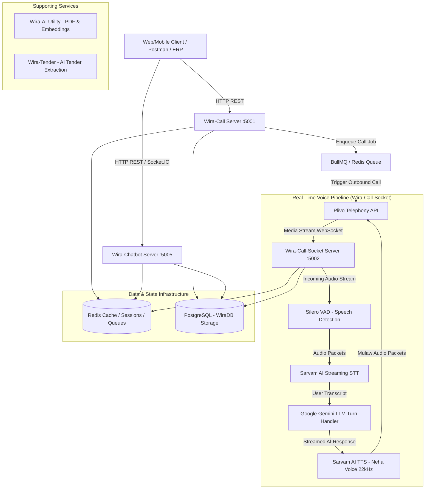

# 🚀 WIRA — AI Voice Telephony & Multi-Service Automation Platform

**WIRA** is an enterprise-grade, microservice-based AI platform built for **White Force**. It powers automated outbound/inbound voice screening calls, payroll recovery AI agents, candidate chatbot assistants, tender intelligence processing, and PDF resume generation.

The system combines real-time telephony streaming (Plivo WebSockets), Indian-language Speech-to-Text & Text-to-Speech (Sarvam AI), high-speed LLMs (Google Gemini & Groq), and dual-layer data persistence (Redis transient state + PostgreSQL persistent store).

---

## 📐 Architecture Overview



---

## 🧩 Microservices & Modules Breakdown

The project is structured as a workspace containing isolated microservices managed by **PM2**:

| Service Name | Port | Entry File | Description |
| :--- | :---: | :--- | :--- |
| **`Wira` (Main Hub)** | `5000` | [Wira/index.js](file:///media/priyanshu/NewVolume/Priyanshu%20Garg/WIRA/Wira/index.js) | Central gateway and primary health monitoring service. |
| **`Wira-Call`** | `5001` | [Wira-Call/index.js](file:///media/priyanshu/NewVolume/Priyanshu%20Garg/WIRA/Wira-Call/index.js) | Telephony dispatch HTTP server. Handles outbound call queues, Plivo XML webhooks, call concurrency locks, and monitoring routes. |
| **`Wira-Call-Socket`** | `5002` | [Wira-Call-Socket/index.js](file:///media/priyanshu/NewVolume/Priyanshu%20Garg/WIRA/Wira-Call-Socket/index.js) | WebSocket server handling real-time audio streams between Plivo, Sarvam AI STT/TTS, and Gemini LLM with VAD barge-in support. |
| **`Wira-Chatbot`** | `5005` | [Wira-Chatbot/index.js](file:///media/priyanshu/NewVolume/Priyanshu%20Garg/WIRA/Wira-Chatbot/index.js) | Socket.IO AI Assistant for candidate & recruiter interactions, WhatsApp automation, and DB search. |
| **`Wira-AI`** | N/A | Utility Module | PDF builder, JD templates, official resume generator, audio & text embedding generators. |
| **`Wira-Tender`** | N/A | Utility/Routes | Web scrapers, document chunking, and AI-driven tender requirement extraction for White Force. |
| **`shared`** | N/A | Core Library | Shared PostgreSQL abstraction (`WiraDB.js`), Redis configuration, Plivo & Sarvam handlers, and LLM engines (`executeAI.js`). |

---

## 🎙️ Telephony & AI Voice Call Flow

### 1. Outbound HR Screening Call (`outbound-screening`)
- **Purpose**: Automated screening of job candidates.
- **Pipeline**:
  1. REST request sent to `Wira-Call` (`/call/make-plivo-call`).
  2. Plivo dials candidate and connects Plivo WebSocket stream to `ws://server:5002/outbound-screening`.
  3. Pre-cached intro audio plays via Sarvam TTS.
  4. Candidate speech is streamed to Sarvam STT.
  5. User response is processed by Gemini LLM (`gemini-2.5-flash-lite`).
  6. AI response is spoken back using Sarvam TTS.
  7. Full transcript, QA pairs, candidate interest, and call costs are stored in PostgreSQL (`wira_outbound_screening`).

### 2. Outbound Payroll Payment Notice (`outbound-payroll-reminder` & `outbound-payroll-overdue`)
- **Purpose**: Payment collection notice and commitment date tracking for overdue client accounts.
- **Dedicated Telephony Credentials**: Plivo Number `+918031703171` (`PLIVO_PAYROLL_AUTH_ID` & `PLIVO_PAYROLL_AUTH_TOKEN`).
- **Voice Setup**: Sarvam AI **Neha** voice model at **22kHz** (`speaker: "neha"`, `sampleRate: 22000`).
- **Conversation Logic**:
  - **`reminder`**: One-shot gentle reminder 3 days prior to due date.
  - **`overdue`**: Dynamic AI conversation. Pushes back on vague user responses ("soon", "very soon") to obtain specific date commitments (`<commit_date:DD Month YYYY>`).

---

## 🗄️ Architectural State Strategy

The system enforces a strict state isolation policy:

- **Transient State (Redis)**:
  - Active call session state (`screening:callId:${callUUID}`).
  - Live socket audio buffers & VAD status.
  - Cost accumulators & phone number concurrency locks.
- **Persistent State (PostgreSQL via `WiraDB`)**:
  - `wira_call` / `wira_payroll_call`: Historical call metadata, duration, status, billing cost summaries.
  - `wira_outbound_screening`: Transcripts, structured QA evaluation, and candidate eligibility ratings.
  - Tender intelligence records, candidate master profiles, and chatbot logs.

---

## 🛠️ Technology Stack

- **Runtime & Framework**: Node.js (CommonJS format), Express, WebSocket (`ws`), Socket.IO
- **Telephony Provider**: Plivo (REST API & Audio WebSockets)
- **Speech AI**: Sarvam AI (`sarvamai` SDK — Speech-to-Text & Text-to-Speech `bulbul:v3`, Neha voice)
- **Conversational LLM**: Google Gemini (`@google/genai`, `@google/generative-ai`), Groq SDK (fallback engine), Ollama
- **Voice Activity Detection**: `node-vad` / Silero VAD (16kHz audio stream barge-in)
- **Queues & Caching**: Redis, BullMQ
- **Database**: PostgreSQL (`pg`), MySQL (legacy compatible)
- **Process Orchestration**: PM2 ([ecosystem.config.js](file:///media/priyanshu/NewVolume/Priyanshu%20Garg/WIRA/ecosystem.config.js))

---

## ⚙️ Environment Variables Reference

Create a root `.env` file (or module-specific `.env` files) with the following required parameters:

```env
# Server Configurations
PORT=5000
CALL_SERVER_PORT=5001
SOCKET_SERVER_PORT=5002
CHATBOT_PORT=5005
NODE_ENV=production

# Database Configuration (PostgreSQL)
PG_HOST=localhost
PG_PORT=5432
PG_USER=postgres
PG_PASSWORD=your_password
PG_DATABASE=wira_db

# Redis Configuration
REDIS_HOST=127.0.0.1
REDIS_PORT=6379
REDIS_PASSWORD=

# Plivo HR Screening Credentials
PLIVO_AUTH_ID=your_plivo_auth_id
PLIVO_AUTH_TOKEN=your_plivo_auth_token
PLIVO_PHONE_NUMBER=+9180XXXXXXXX

# Plivo Payroll Dedicated Credentials
PLIVO_PAYROLL_AUTH_ID=your_payroll_auth_id
PLIVO_PAYROLL_AUTH_TOKEN=your_payroll_auth_token
PLIVO_PAYROLL_PHONE_NUMBER=+918031703171

# Sarvam AI Credentials
SARVAM_API_KEY=your_sarvam_api_key

# Google Gemini LLM API Keys
GEMINI_API_KEY=your_gemini_api_key

# Groq API Keys (Fallback)
GROQ_API_KEY=your_groq_api_key
```

---

## 🚀 Installation & Setup

### Prerequisites
- Node.js (v18 or higher)
- PostgreSQL
- Redis Server
- PM2 (`npm install -g pm2`)
- FFMPEG

### 1. Install Dependencies
```bash
# Install root & workspace dependencies
npm install
```

> **Automatic Post-Install Patch**: Running `npm install` automatically executes `node scripts/patch-sarvam-ws.js` to ensure WebSocket compatibility for Sarvam AI streaming STT.

### 2. Running Microservices via PM2

```bash
# Start all microservices in production mode
pm2 start ecosystem.config.js

# Monitor live logs
pm2 logs

# Check service status
pm2 status
```

### 3. Running Microservices Individually (Development)

```bash
# Start Call Server
node Wira-Call/index.js

# Start Socket Server
node Wira-Call-Socket/index.js

# Start Chatbot Server
node Wira-Chatbot/index.js
```

---

## 📑 API Quick Reference

### Outbound Call Trigger Endpoint

- **URL**: `POST http://localhost:5001/call/make-plivo-call` (or domain equivalent)
- **Headers**: 
  - `Content-Type`: `application/json`
  - `x-api-key`: `<WIRA_API_KEY>`

#### Payroll Overdue Call Payload:
```json
{
  "type": "outbound-payroll-overdue",
  "to": "+919876543210",
  "clientName": "Priyanshu Garg",
  "companyName": "White Force",
  "amount": "25000",
  "dueDate": "1st September 2026"
}
```

#### HR Candidate Screening Payload:
```json
{
  "type": "outbound-screening",
  "to": "+919876543210",
  "candidateName": "John Doe",
  "jobTitle": "Node.js Developer",
  "companyName": "White Force",
  "language": "en"
}
```

---

## 📜 Compliance & Coding Standards

- **Module Format**: CommonJS (`require` / `module.exports`).
- **Object-Oriented Design**: Class-based Managers (`*Manager.js`).
- **Standardized API Response**:
  ```json
  {
    "statusCode": 200,
    "success": true,
    "message": "Descriptive message",
    "data": {}
  }
  ```
- **Error Handling**: Standardized emoji logging (`🗣️ [VAD]`, `🎙️ [AI]`, `💰 [Plivo]`, `❌ [Error]`, `✅ [Success]`, `▶️ [Stream]`).
